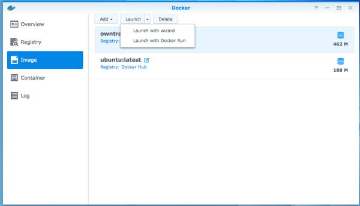
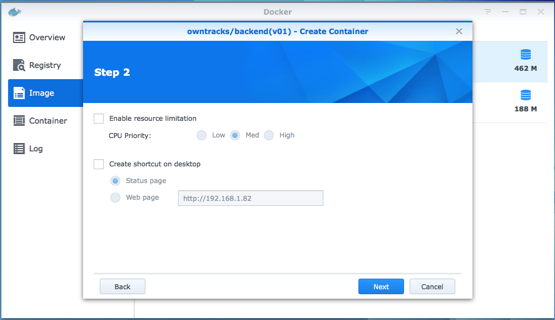
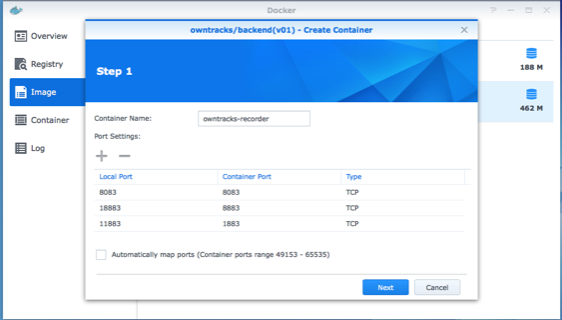
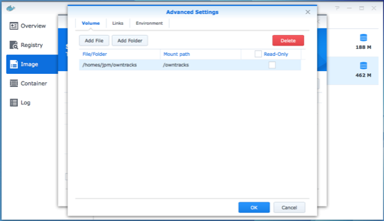
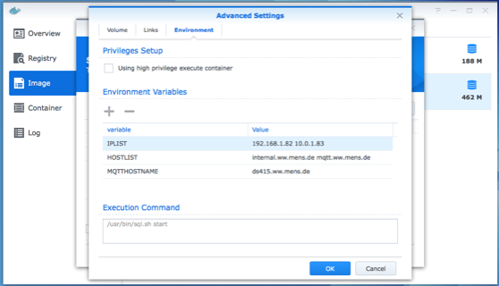
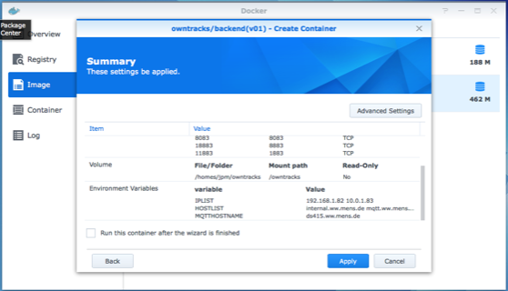
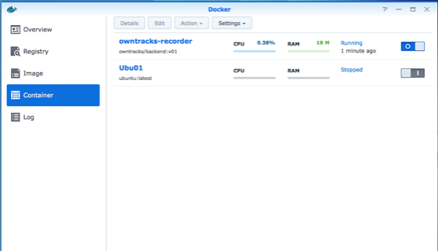
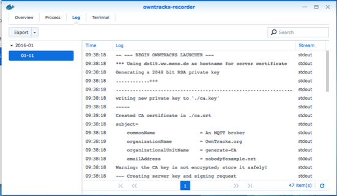

## Recorder

The [OwnTracks Recorder][1] is a lightweight program for storing and accessing location data published via MQTT by the OwnTracks apps. It is a compiled program which is easily to install and operate even on low-end hardware, and it doesn't require external an external database.

### Docker

We have an [experimental Docker image](https://hub.docker.com/r/owntracks/backend/) which you can use to launch the Recorder and its associated [Mosquitto] broker. The image expects a volume which you mount into it into which it will write persistent data. Furthermore, you pass environment variables into the container at first launch with which TLS certificates are created with subject (and subjAltNames) according to your preference. 

As an example, let's assume the host on which the Docker container will run has two IP addresses, `192.168.1.82` and `10.0.1.83`. We will also assume that you want the MQTT port on the host to be `11883` and its TLS port to be `18883`. Let's further assume that one of these addresses is DNS accessible as `ds415.ww.mens.de` and the other as `mqtt.ww.mens.de`. We want the TLS certificates for the container's Mosquitto broke to contain subjAltNames for these, so we will proceed as follows:

1. Create a directory which will be mounted into the container for persistent data: `mkdir /var/owntracks`, say.
2. Launch the Docker container with a script such as this one

```sh
#!/bin/sh

docker run -v /var/owntracks:/owntracks -p 11883:1883 -p 18883:8883 -p 8083:8083 \
	--hostname ds415.ww.mens.de \
	-e MQTTHOSTNAME="ds415.ww.mens.de" \
	-e IPLIST="192.168.1.1 192.168.1.82" \
	-e HOSTLIST="mqtt.ww.mens.de ds415.ww.mens.de" \
	owntracks/backend:v01
```

That should download the Docker image (if necessary) and launch a container accordingly. At first run, the TLS certificates are created in the `/owntracks` volume (which was mounted onto `/var/owntracks` on the host). The host's directory will also contain a `mosquitto/` directory which Mosquitto's configuration file, and the Recorder will use `/owntracks/recorder/` as its persistent storage.

### Synology

A number of Synology devices with newer DSM support Docker; please refer to the original documentation to determine if yours has Docker support. If it does, [this page](http://blog.pavelsklenar.com/how-to-install-and-use-docker-on-synology/) describes how to use Docker. Once you've installed the package, you can proceed to download the Recorder image and launch a container.

Launch container creation with the wizard, and give the container a name, e.g. `owntracks-recorder`.



Leave the settings in Step 2 as they are.



Add the TCP ports for MQTT (plain), MQTT (over TLS), and the Recorder's HTTP interface.



In the _Volume_ tab, add a host folder which will be mounted into the container. Here we've chosen `/home/jpm/owntracks` which we first created with DSM's file manager.



In the _Environment_ tab add the variables which will be exported into the container. Note that `IPLIST` and `HOSTLIST` (both of which are optional) take a space-separated list of values.



Check everything and press _Apply_ to have the container created.



The container can then be launched by pressing the "on" switch.



The Docker container log will show console output.



  [1]: https://github.com/owntracks/recorder
  [mosquitto]: http://mosquitto.org
