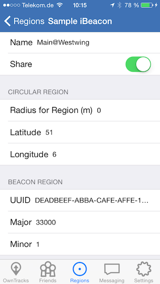
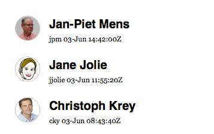
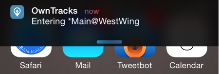

## iBeacons

If you want to monitor an iBeacon region rather than a circular region set the
radius to zero (`0`) or a negative value, and add the beacon UUID, major, and minor numbers.



You add the UUID of the beacon to the description, and you can optionally specify the major and/or
minor identifier numbers of the beacons as a decimal number ranging from 1 to 65535 if you desire finer control over which beacons OwnTracks will monitor.
Setting major or minor number to zero (`0`) means no major or minor number is specified.

If the UUID is valid, iBeacon monitoring will start.

Examples:

```
myBeacons:CA271EAE-5FA8-4E80-8F08-2A302A95A959
mySpecificBeacon:CA271EAE-5FA8-4E80-8F08-2A302A95A959:1:33000
```

In the first example above, OwnTracks will monitor all beacons with the specified UUID, whereas
in the second example, OwnTracks would monitor just that one specific beacon with the major number `1` and the minor number `33000`.

## Example: office

Upon arriving at our Frankfurt location, I see from the monitor panel at the reception that Jane is in the office, so I'll pop in to ask a question.




Instead of relying solely on the location your smart phone thinks you are at, small, and relatively inexpensive [iBeacons](http://en.m.wikipedia.org/wiki/IBeacon) can pinpoint you down to a few meters. OwnTracks for iOS has had support for iBeacons for a few releases now, and it works very reliably.

Beacons use Bluetooth low energy to transmit a UUID (typically modifiable) together with user-defined _major_ and _minor_ numbers, and these allow us to identify, say, a particular room in a building or even a specific corner of a room. The _major_ number can be used, say, to identify an office building, whereas you'd configure a beacon's _minor_ number to identify a room within that building. Alternatively, if you don't want to bother with identifying rooms, you can e.g. set all beacons to have the same _major_ and _minor_ numbers.

Let's assume the office we're discussing has a few beacons. Let's further assume we do not want to track people within a particular room; instead we just want to capture whether an employee is in this particular office building. We can configure all beacons with the same UUID, and we will ignore the _major_ and _minor_ numbers. (How a beacon gets it's UUID, _major_, and _minor_ set depends on the product.)

We define a UUID, say, `DEADBEEF-ABBA-CDEF-1001-000000000001` which we assign to all beacons, and configure them accordingly. (The [Blukii] iBeacons we use have a utility with which we can configure them accordingly.)

What we then do is configure a waypoint within the iOS OwnTracks app. The values for latitude/longitude are irrelevant. What is important is the UUID separated from the name of the beacon (I chose `Main@WestWing` here) by a colon. A beacon's _major_ and _minor_ are optionally concatenated to that string, also colon-separated.

Instead of painstakingly configuring this on the device proper, I prepare a small file called `office.otrw` (the `.otrw` extension is important), with the following [JSON](../tech/json.md) payload:

```json
{
  "waypoints" : [
    {
      "tst" : 1432817332,
      "lat" : 52.0,
      "_type" : "waypoint",
      "lon" : 6.0,
      "rad" : 0,
      "desc" : "Main@WestWing:DEADBEEF-ABBA-CAFE-AFFE-123456789012:0001"
    }
  ],
  "_type" : "waypoints"
}
```


I then either place that file on a Web server, or e-mail it as attachment to my colleagues who open that on their OwnTracks device, and presto: the device has the beacon monitoring regions configured.

From this point on, OwnTracks monitors all beacons with that particular UUID, and it will publish an `enter` or `leave` event whenever the device gets within range of a beacon or leaves it. Additionally, the device shows the event with a local iOS notification.



We publish these [events as JSON](../tech/json.md) via MQTT to the MQTT broker the device is connected to, and from there, you consume the message and do as you please.

```json
{
    "_type": "transition",
    "acc": 65,
    "desc": "Main@WestWing",
    "event": "enter",
    "lat": 2.2222,
    "lon": 1.1111,
    "tid": "jp",
    "tst": 1433342520,
    "wtst": 1432817332
}
```

For instance, send an e-mail when a particular person leaves the building, publish a list of people who remain in the building on a monitor (as above), etc.

To summarize: OwnTracks can monitor beacons by configuring it either with:

* a _UUID_ only, in which case the app would report any beacon with that UUID, irrespective of its _major_/_minor_ numbers.
* a _UUID_ with a _major_ number: the app would report iBeacons with the specified UUID and exactly that _major_ number
* all three: the _UUID_, the _major_ and _minor_ numbers, in which case the app reports events on precisely that beacon.

## Notes

The app recognizes the beacon typically within 10 seconds, which is a typical beacon-publishing frequency, and this is very good for presence detection.

If you use a `-` as the first character in your Waypoint description e.g. `-MyBeacon`, the app will ignore short disruptions of the connection to the beacon (hold down).

Setting the radius to a negative value (e.g. `-1`), the app will update the location coordinates of the waypoint on each enter/leave event. This update will be transmitted to the broker when the `share` option is on and will be reflected on your map screen. You may use this to keep track of moveable items as luggage or your car.


  [blukii]: http://www.blukii.com/beacons_en.html
