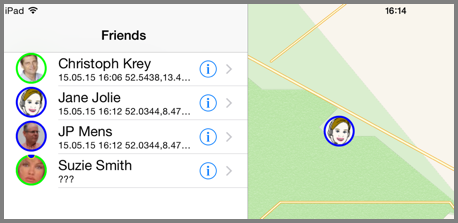

## Card

OwnTracks typically displays the _TID_ of a [friend](friends.md) on the map, but you can associate an address book entry to that friend in order to see a friendly face (if you have you friend's photo in your device's address book) and/or a friendly name.



We developed a new feature we call a _card_ which you can use when in _Private mode_ and in _HTTP mode_. A card is a retained message which contains a [JSON payload](../tech/json.md) which, in absence of an address-book association, will be used to populate your friend on your map. The payload contains a full name (hopefully one you recognize), and an avatar -- a small image. If a card exists it will be used, but you can override its use in OwnTracks by associating your friend with an address book entry of your own device.

```json
{
  "_type": "card",
  "name": "Jane Jolie"
  "face": "iV1CFEVkMhmCIKBUKh3 ... ghAAAAABJRU5ErkJggg==",
}
```

### Creating a card

We provide several utilities for creating a _card_ in the [Recorder's repository](https://github.com/owntracks/recorder/tree/master/contrib/faces):

* If you have an image file you want to use, use `image2card.sh`, passing _image-filename_ and _fullname_.
* If you know a user has a Github profile with a name and an avatar, use `github2card.py` which takes a Github username as argument.
* If you know a user has a Gravatar, use `gravatar2card.sh`, passing _email_ and _fullname_.

These utilities create a _card_ on standard output, and you typically then publish the result as a retained message to your MQTT broker:

```
./github2card.py defunkt > my-card.json
mosquitto_pub -t owntracks/jjolie/phone/info -f my-card.json -r
```

Note the topic branch ending in `info` and note the use of the retain flag (`-r`).
