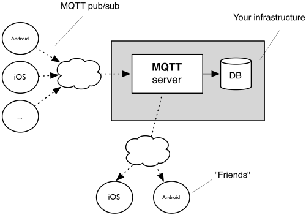

# How OwnTracks works

The OwnTracks apps run on your smart phone (but we've already mentioned that at least once, haven't we?). When the device determines that it's _moved_ a significant distance[^1], it contacts a server via 3G or WiFi (hopefully one of those is available) and says "_hey, I'm here_", whereby "_here_" is specified with a bit more precision. This server is called a _broker_ and the contact is made with an open, lightweight, [standardized protocol called MQTT](mqtt.md). (If you think that's bad it isn't: the protocol you use to surf the Web is called HTTP; does that sound much better?) So the smart phone sends your location (this operation is called _publish_ in MQTT-speak) to the broker and goes back to sleep until it realizes you've again moved a significant distance whereupon the whole procedure starts anew. This broker is ideally something you provide, but we can help you out to start with by lending you the use of ours, free of charge for a while.

*Above: the general architecture of OwnTracks*

The broker receives the data, and then? Well, it can re-distribute it, at your wish. What this basically means is it can forward your location to a friend, [to a program](clients.md) which stores your location in, say, a database, etc. There are plenty of things you can do, and we'll show you some of them later.

The important message here, and we can't repeat this often enough: OwnTracks is designed in such a way as that you can chose what you do with your data. It's *yours*.

## Basic setup

OwnTracks used to be difficult to set up particularly because you had to provide the server (called a _broker_, remember?) yourself, but we've gone to great lengths to make it easy for you to try before you'll want to take it upon yourself to do all the setup work.

We'll now cover the [three basic scenarios](scenarios.md).

[^1]: This is a relative amount, but you can tune it a bit.
