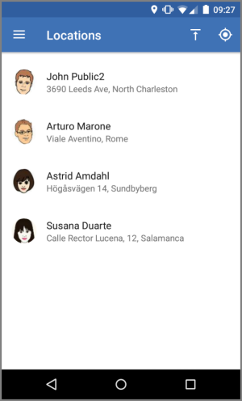

## Scenarios

There are three basic scenarios we have for you depending on your needs. It'll help if you keep a copy of the [technical terminology](../terminology.md) handy.

## Public

The very first time you install OwnTracks it will be configured in _public mode_. In this mode, the app "just works". It connects to our public MQTT broker, and your location is published there anonymously. In the app you'll also see any other public users, although you won't be able to identify them (nor they you): there are, other than the location data, no personal details of any user. The one exception is a couple of pseudo-users we publish magically so that you have something nice to look at.

We mentioned earlier that this is not a mode in which you want to run OwnTracks; it's basically just a demonstration mode for you to get a feeling for how OwnTracks looks and works. The data published by OwnTracks in this mode is not retained, and we don't store it.

Using _Public_ mode means you don't *have* to learn about [MQTT brokers](broker.md), [topics](topics.md), and all the rest of the stuff, but the downside is that you don't get to use any of the neat features _MQTT_ mode or _HTTP_ mode come with. For example, you can't set up [friends](friends.md) or configure [clients to use your data](clients.md) for the sole reason that we don't tell you the address or the authentication credentials for _Public_ mode. Yep, it's as they say: *you get what you pay for*. :-)

We think it's best you forget about this as quickly as possible and chose one of the other modes.

## HTTP mode

If you don't want to go to the trouble of hosting your own MQTT setup, you can use _HTTP_ mode to publish location data to a [HTTP server of your chosing](../tech/http.md).

## MQTT mode

This is where you say *adios!* (or whatever you say in your language when you leave) to us, continue to use our app (still free of charge of course -- it's Open Source), and host everything yourself. And to be honest, that's *precisely what we think you should do* so that you only (and the people you authorize) see where you are. That is the *Own* in OwnTracks: it's *your own data* and you only should see it.

In MQTT mode you're on your own: you [set up and configure your MQTT broker](broker.md), you configure authentication, and then you configure your OwnTracks apps to connect to your broker. It's not particularly difficult to do, and you have full control over everything you set up.

What you basically have to do is to

* [set up an MQTT broker](broker.md)
* Optionally [use existing clients](clients.md) to consume OwnTracks data
* Possibly dig in and [write your own client](../tech/program.md) and do really cool stuff!

We urge you to resist the temptation of using _MQTT mode_ with one of the many public brokers hosted by different organizations. While it _is_ an easy way out those brokers are publically accessible which means anybody can see where you are if they can identify you. Furthermore, public brokers often don't implement access control, so basically anybody can create a "location" update which looks as though it may be yours. Believe us: it'll drive you crazy.

If you need assistance, we may be able to help you on our [Talk](https://github.com/owntracks/talk) site.

You will now want to [configure a client](clients.md) with which you consume the data which is published by OwnTracks, or if you're feeling very brave, why not [write your own client](../tech/program.md)?

Now it's time to [discuss topics](topics.md).
