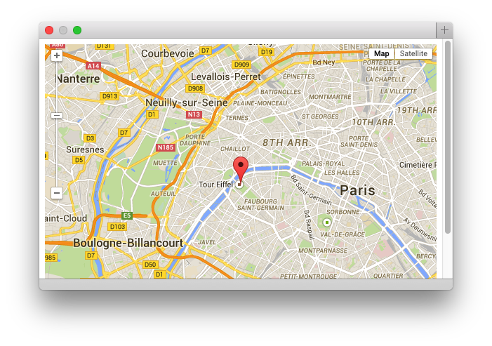

# Programming

We've [shown you some clients which consume OwnTracks data](../guide/clients.md), but you may well wish to dip your fingers into programming something of your own. Creating a program to consume OwnTracks data isn't particularly difficult, and we're going to show you what you can do with a bit of [Python](https://www.python.org) together with the [Paho Python client](https://www.eclipse.org/paho/clients/python/).

## Getting started: Paho Python


We're assuming you have Python installed, which you can verify by attempting to invoke `python -V`; if installed, it tells you the version number. We're also assuming you have `pip` installed (a Python package manager) which may be called `pip2` or something on your machine. You may have to install `setuptools` via your distribution's package manager.

Install the [Paho Python](https://www.eclipse.org/paho/clients/python/) module using

```bash
pip install paho-mqtt
```

## Progress reports

Assume we want to create a program which should report the location of our friends, as a simple list:

```
TID = n4 is currently at 51.0343863, 9.4763712
TID = n7 is currently at 52.7343671, 7.8764431
TID = jp is currently at 53.134404655, 8.1063173
```

We need a small utility program which will subscribe to location publishes received by your broker by connecting to it on _localhost_ and subscribing to `owntracks/+/+` (a wild-card expression in which each `+` means _anything at this level_).

### The Code

For each received message, the utility attempts to decode the JSON payload and then prints the tracker-ID (_TID_) as well as latitude, longitude coordinates. Keep a copy of our [OwnTracks-JSON](json.md) documentation handy and study the topic names of each possible publish by the apps.


```python
#!/usr/bin/env python

import paho.mqtt.client as mqtt
import json

# The callback for when the client successfully connects to the broker
def on_connect(client, userdata, rc):
    ''' We subscribe on_connect() so that if we lose the connection
        and reconnect, subscriptions will be renewed. '''

    client.subscribe("owntracks/+/+")

# The callback for when a PUBLISH message is received from the broker
def on_message(client, userdata, msg):

    topic = msg.topic

    try:
        data = json.loads(str(msg.payload))

        print "TID = {0} is currently at {1}, {2}".format(data['tid'], data['lat'], data['lon'])
    except:
        print "Cannot decode data on topic {0}".format(topic)

client = mqtt.Client()
client.on_connect = on_connect
client.on_message = on_message

client.connect("localhost", 1883, 60)

# Blocking call which processes all network traffic and dispatches
# callbacks (see on_*() above). It also handles reconnecting.

client.loop_forever()
```

## Micro Map

Assume for a moment that you alter the program above in such a way as that it writes your current location in JSON format to a file called `me.json` which could look like this:

```json
{
	"lat": 48.858334,
	"lon" : 2.295134,
	"tid":"JJ"
}
```

We could then create a Web page which would load that JSON and display a marker on a map.



### index.html


```html
<!DOCTYPE html>
<html>
  <head>
    <title>Micromap</title>
    <meta name="viewport" content="width=device-width, height=device-height, user-scalable=no, initial-scale=1.0" />

    <meta name="mobile-web-app-capable" content="yes">
    <meta name="apple-mobile-web-app-capable" content="yes">
    <style type="text/css">
      body {  font-size: 80%; }

      td { border-bottom: 1px solid; border-right: 1px dotted;}

      #map-canvas { height: 100% }

    </style>
     <script src="https://maps.googleapis.com/maps/api/js?v=3.exp&sensor=false"></script>
     <script src="http://code.jquery.com/jquery-1.9.1.min.js"></script>
     <script src="http://code.jquery.com/jquery-migrate-1.1.1.min.js"></script>
    <script src="functions.js"></script>
  </head>
  <body>
    <div>
      <div id="map-canvas" style='width: 100%; height: 400px;'/></div>
    </div>
  </body>
</html>
```

### functions.js


```js
function initialize() {
    var json = (function () {
        var json = null; 
        $.ajax({ 
            'type' : 'GET',
            'async': false, 
            'cache' : false,
            'global': true, 
            'url'   : 'me.json',  // URI of JSON file we create
            'dataType': "json", 
            'success': function (data) {
                json = data;
                return json;
             }
        });
    return json;
    })();

    var data = json;
    console.log(JSON.stringify(data));

    var center = new google.maps.LatLng(data.lat, data.lon);
    mapOptions = {
        center: center,
        zoom: 12,
        mapTypeId: google.maps.MapTypeId.ROADMAP,
        scrollwheel: false,
        disableDefaultUI: false,
        panControl: false,
        scaleControl: false,
        streetViewControl: false,
        overviewMapControl: false,
    };

    map = new google.maps.Map(document.getElementById("map-canvas"), mapOptions);

    var LatLng = new google.maps.LatLng(data.lat, data.lon); 
    var m = new google.maps.Marker({
        position: LatLng,
        map: map,
        title: data.tid,
    });
}
google.maps.event.addDomListener(window, 'load', initialize);
```

would result in a map being displayed in your Web browser with a marker at the last location received by your MQTT broker. Note: the marker won't move; we leave that as an exercise to you, or just head over and look [at some clients](../guide/clients.md) which do that for you.


## Testing

Testing location-based apps is a bit of a, well, pain, but remember there are a few simple tricks you can apply:

* Use the _publish now_ button in OwnTracks to fire a location update. The smart phone won't really _move_ much of course, but it'll allow you to test your program a bit.
* Publish your own [OwnTracks-JSON](json.md) payload to the broker with _mosquitto_pub_ or similar.

## Last words

Consuming OwnTracks messages from your MQTT broker isn't particularly difficult, and people have built nice programs doing so. 
